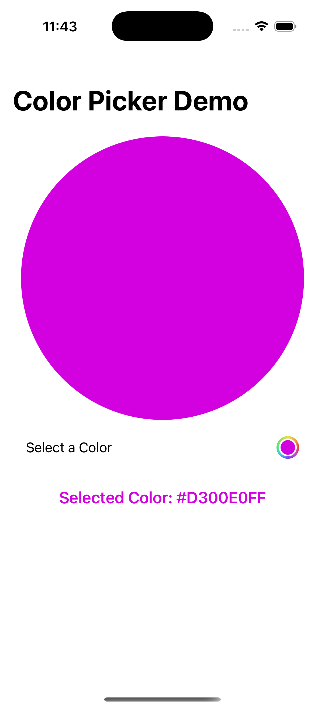
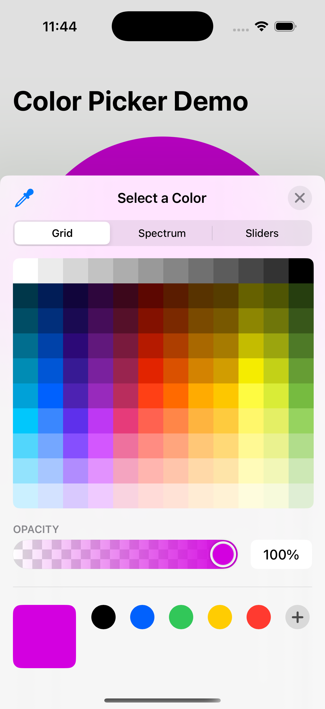

# ColorPickerDemo

## Example of how to include png/mp4 links in md file for GitHub

A SwiftUI demo showing how to use ColorPicker and persist the chosen color in UserDefaults using AppStorage.

## Features

    • SwiftUI ColorPicker integrated into a simple demo view.
    • Selected color is stored as a hex string in AppStorage.
    • Colors persist across app launches.
    • Conversion between Color ↔ Hex String with a helper extension.
    • Option to disable opacity if you only want solid colors.

## Setup

    1. Download ColorPickerView.swift from this repo.
    2. Create a new SwiftUI project in Xcode.
    3. Add ColorPickerView.swift to your project.
    4. Run the app on the simulator or device.

## Storing Color in UserDefaults

Since UserDefaults only supports basic types (Int, String, etc.), we convert the selected color into a hex string before saving.

    • Example: #FF0000FF → Red with full opacity.
    • The stored string is restored back to a Color on app launch.

This is handled with the included Color extension.

## Screenshots

| Demo | Color Picker |
|------|--------------|
|  |  |

## Screen Recording

[🎥 Watch the screen recording](Screenshots/ColorPickerScreenRecording.mp4)

## MyChronoPro Lap Tracker  

Try out the Color Picker feature inside the MyChronoPro stopwatch app:

👉 [See the Color Picker in action on the App Store](https://apps.apple.com/app/mychronopro-lap-tracker/id6746975883)

## Example Code

            // supportsOpacity is optional, defaults to true
            ColorPicker("Select a Color", selection: $selectedColor, supportsOpacity: true)
            
            // Use onChange to react to changes in the color picker
            .onChange(of: selectedColor) { _, newColor in
                colorHex = newColor.hexString
            }
